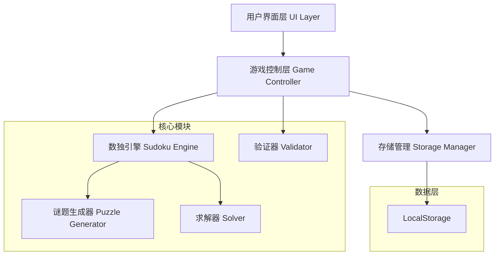
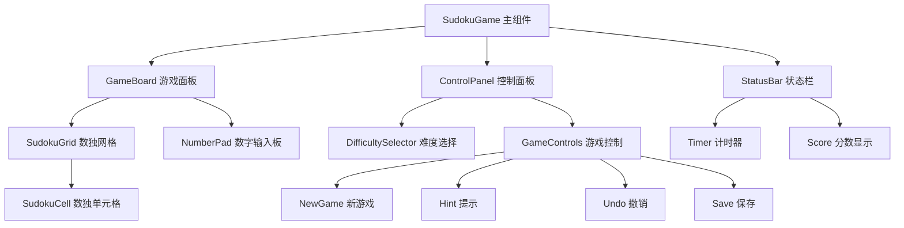
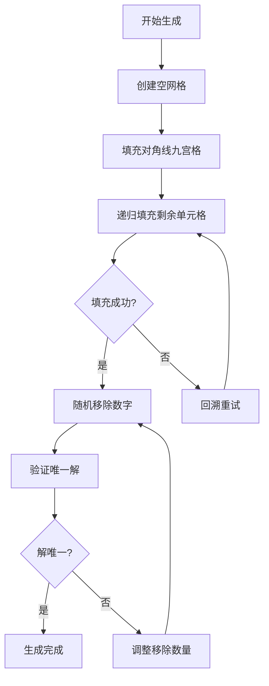
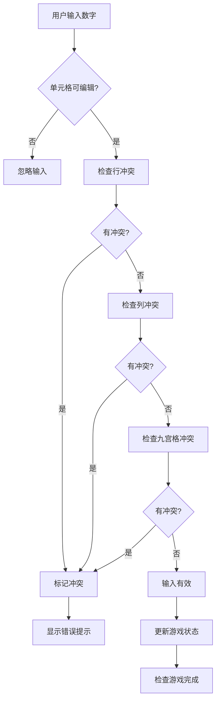
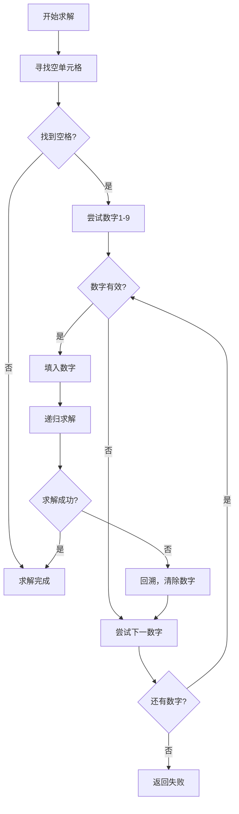

# 数独小游戏设计文档

## 1. 概述

数独小游戏是一个基于 Web 的经典数字逻辑益智游戏。游戏目标是在 9×9 的网格中填入数字 1-9，使得每行、每列以及每个 3×3 的九宫格内都包含 1-9 的所有数字且不重复。

### 1.1 核心特性
- 9×9 数独网格界面
- 多种难度等级（简单、中等、困难）
- 数字输入和验证
- 实时错误检查
- 游戏计时功能
- 提示系统
- 保存/加载游戏进度

### 1.2 技术栈
- **前端**: HTML5, CSS3, JavaScript (原生或 React)
- **样式**: CSS Grid/Flexbox 布局
- **数据存储**: LocalStorage (本地存储)
- **数独生成**: 算法生成随机数独谜题

## 2. 系统架构

### 2.1 整体架构图



### 2.2 模块职责

| 模块 | 职责 |
|------|------|
| UI Layer | 渲染游戏界面，处理用户交互 |
| Game Controller | 协调各模块，管理游戏状态 |
| Sudoku Engine | 数独核心逻辑，谜题管理 |
| Validator | 数字输入验证，冲突检查 |
| Storage Manager | 游戏进度保存和加载 |
| Puzzle Generator | 生成随机数独谜题 |
| Solver | 数独求解算法，提示功能 |

## 3. 组件架构

### 3.1 前端组件层次结构



### 3.2 核心组件说明

#### 3.2.1 SudokuGrid 组件
```
属性:
- gridData: 9×9 数字数组
- initialGrid: 初始谜题数据
- selectedCell: 当前选中单元格
- conflicts: 冲突单元格列表

方法:
- onCellClick(row, col): 处理单元格点击
- onNumberInput(number): 处理数字输入
- validateInput(row, col, number): 验证输入合法性
- highlightRelated(row, col): 高亮相关单元格
```

#### 3.2.2 SudokuCell 组件
```
属性:
- value: 单元格数值
- isInitial: 是否为初始数字
- isSelected: 是否被选中
- hasConflict: 是否有冲突
- isHighlighted: 是否高亮显示

状态样式:
- initial-cell: 初始数字样式
- selected-cell: 选中单元格样式
- conflict-cell: 冲突单元格样式
- highlighted-cell: 高亮单元格样式
```

## 4. 核心功能设计

### 4.1 数独谜题生成算法



### 4.2 输入验证流程



### 4.3 游戏状态管理

| 状态 | 描述 | 触发条件 |
|------|------|----------|
| MENU | 菜单界面 | 游戏启动，返回主菜单 |
| PLAYING | 游戏进行中 | 开始新游戏，加载游戏 |
| PAUSED | 游戏暂停 | 点击暂停按钮 |
| COMPLETED | 游戏完成 | 所有数字正确填入 |
| ERROR | 错误状态 | 系统错误 |

### 4.4 难度等级设计

| 难度 | 已填数字 | 移除数字 | 预估时间 |
|------|----------|----------|----------|
| 简单 | 35-40 | 41-46 | 5-15分钟 |
| 中等 | 28-35 | 46-53 | 15-30分钟 |
| 困难 | 22-28 | 53-59 | 30分钟以上 |

## 5. 数据模型设计

### 5.1 游戏数据结构

```javascript
GameState = {
  id: string,                    // 游戏唯一标识
  difficulty: 'easy|medium|hard', // 难度等级
  initialGrid: number[][],       // 初始谜题 (9x9)
  currentGrid: number[][],       // 当前状态 (9x9)
  isInitial: boolean[][],        // 标记初始数字 (9x9)
  conflicts: {row: number, col: number}[], // 冲突位置
  selectedCell: {row: number, col: number}, // 选中单元格
  startTime: timestamp,          // 开始时间
  elapsedTime: number,          // 已用时间(秒)
  hintsUsed: number,            // 使用提示次数
  status: 'playing|paused|completed'
}
```

### 5.2 用户进度数据

```javascript
UserProgress = {
  userId: string,
  statistics: {
    gamesPlayed: number,
    gamesCompleted: number,
    bestTimes: {
      easy: number,
      medium: number,
      hard: number
    },
    totalHintsUsed: number
  },
  savedGames: GameState[],
  settings: {
    showTimer: boolean,
    highlightConflicts: boolean,
    autoNotes: boolean
  }
}
```

## 6. 用户界面设计

### 6.1 界面布局

```
┌─────────────────────────────────────────┐
│           数独小游戏                      │
├─────────────────────────────────────────┤
│  难度: [简单] [中等] [困难]  时间: 05:23  │
├─────────────────────────────────────────┤
│  ┌─────────────────┐  ┌─────────────────┐ │
│  │                 │  │   [1] [2] [3]   │ │
│  │   9x9 数独网格   │  │   [4] [5] [6]   │ │
│  │                 │  │   [7] [8] [9]   │ │
│  │                 │  │   [清除] [提示]  │ │
│  └─────────────────┘  └─────────────────┘ │
├─────────────────────────────────────────┤
│ [新游戏] [暂停] [保存] [加载] [撤销]      │ │
└─────────────────────────────────────────┘
```

### 6.2 响应式设计考虑

| 设备类型 | 屏幕宽度 | 布局调整 |
|----------|----------|----------|
| 桌面端 | >1024px | 横向布局，网格和控制面板并排 |
| 平板 | 768-1024px | 纵向布局，控制面板在下方 |
| 手机 | <768px | 单列布局，简化控制按钮 |

## 7. 核心算法实现

### 7.1 数独求解算法（回溯法）



### 7.2 冲突检测算法

1. **行检测**: 检查当前行是否有重复数字
2. **列检测**: 检查当前列是否有重复数字  
3. **九宫格检测**: 检查当前3×3九宫格是否有重复数字

### 7.3 提示生成策略

1. **单候选数法**: 找到只有一个可能数字的单元格
2. **隐藏单例法**: 在行/列/九宫格中找唯一位置
3. **随机提示**: 从正确解中随机选择一个位置

## 8. 性能优化策略

### 8.1 算法优化
- 使用位掩码优化候选数字存储
- 缓存已计算的冲突检查结果
- 延迟验证，避免频繁的完整性检查

### 8.2 UI优化  
- 虚拟化大量DOM更新
- 使用CSS3动画替代JavaScript动画
- 图片懒加载和资源预加载

### 8.3 内存管理
- 及时清理不需要的游戏状态
- 限制保存的历史记录数量
- 优化数据结构减少内存占用

## 9. 测试策略

### 9.1 单元测试覆盖范围

| 测试模块 | 测试用例 |
|----------|----------|
| 数独生成器 | 生成有效谜题，唯一解验证 |
| 求解器 | 各种难度谜题求解正确性 |
| 验证器 | 冲突检测准确性 |
| 游戏控制器 | 状态转换，用户操作响应 |
| 存储管理 | 数据保存/加载完整性 |

### 9.2 集成测试场景
- 完整游戏流程测试
- 不同难度级别游戏测试  
- 错误输入处理测试
- 跨浏览器兼容性测试
- 响应式布局测试

### 9.3 用户体验测试
- 操作流畅性测试
- 界面响应时间测试
- 移动端触控体验测试
- 可访问性测试